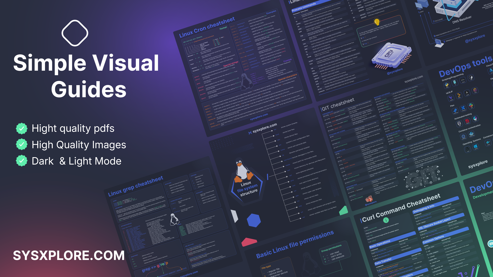

# Tech Visuals 101

[First Steps with Linux](https://read.sysxplore.com/l/first-steps-with-linux?layout=profile) | [Newsletter](https://blog.sysxplore.com) | [Website](https://sysxplore.com) | [Twitter/X](https://twitter.com/sysxplore)

Learn developer tools, Linux, networking, DevOps, security, databases, APIs, and cloud concepts through visuals and simple explanations.

This repository is a collection of visual cheat sheets and infographics for developers, sysadmins, DevOps engineers, security learners, and anyone who wants to understand modern computing concepts faster.

## Topics

- [Linux and command line](#linux-and-command-line)
- [Networking and protocols](#networking-and-protocols)
- [Git, Docker, and Kubernetes](#git-docker-and-kubernetes)
- [DevOps and cloud](#devops-and-cloud)
- [Security and cryptography](#security-and-cryptography)
- [Databases and APIs](#databases-and-apis)
- [Browse the files](#browse-the-files)

## Linux and Command Line

- Linux commands
- Linux directory structure
- Linux file permissions
- Linux file types
- Linux boot process
- Linux architecture
- Linux shells
- Bash scripting
- Bash loops, functions, brackets, and parameter expansion
- Cron
- Grep, awk, sed, find, tar, curl, less, vim, netcat, nmcli
- Redirection and pipes
- Process management
- Logical Volume Manager
- ACLs, UFW, iptables, autofs

## Networking and Protocols

- OSI vs TCP/IP
- Network protocol stack
- Common network protocols
- DNS and DNS record types
- DHCP, ARP, GARP, NAT, NTP, SNMP
- IPv4 vs IPv6
- TCP three-way handshake
- HTTP status codes
- HTTP/2 vs HTTP/3
- Traceroute
- Routing schemes
- VLAN port types
- MAC addresses
- Email protocols

## Git, Docker, and Kubernetes

- Git fundamentals
- Git workflow
- Git commands
- Git merge vs rebase vs cherry-pick
- How Git works
- Docker cheat sheets
- How Docker works
- Docker components
- Containers vs VMs
- Kubernetes components
- Kubernetes scaling strategies

## DevOps and Cloud

- DevOps concepts
- DevOps tools
- Ansible architecture
- Cloud platform models
- Types of servers
- Server hardening
- Admin tips
- Log parsing commands

## Security and Cryptography

- Cybersecurity roadmap
- SSH and SSH server hardening
- TLS/SSL handshake
- Public key cryptography
- Digital signatures
- Encryption types
- SPF, DKIM, and DMARC
- Tokens vs APIs

## Databases and APIs

- SQL cheat sheet
- SQL joins
- Common database types
- Main database types
- API architecture styles
- REST API design

## Browse the Files

The visuals are available in image and PDF formats:

- [Dark theme images](images/dark)
- [Light theme images](images/light)
- [Dark theme PDFs](pdfs/Dark)
- [Light theme PDFs](pdfs/Light)

## License

This work is licensed under [CC BY-NC-ND 4.0](https://creativecommons.org/licenses/by-nc-nd/4.0/).

You may share the original materials for non-commercial purposes with attribution. You may not sell them, use them commercially, or distribute modified versions.

## Contributing

Spotted a typo or an issue? Contributions are welcome for corrections, file organization, and metadata improvements. See [CONTRIBUTING.md](CONTRIBUTING.md).
